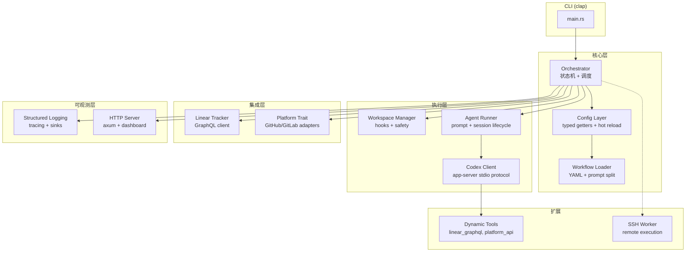
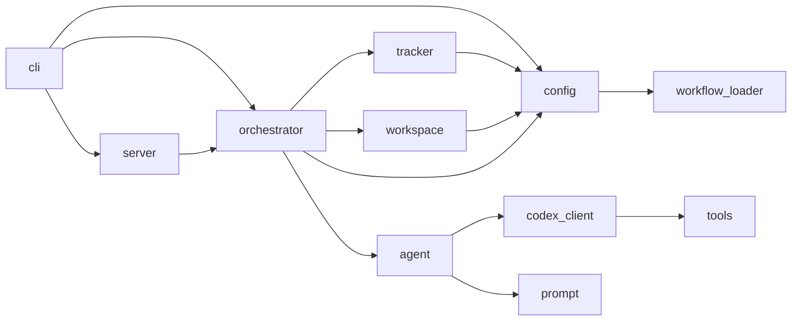
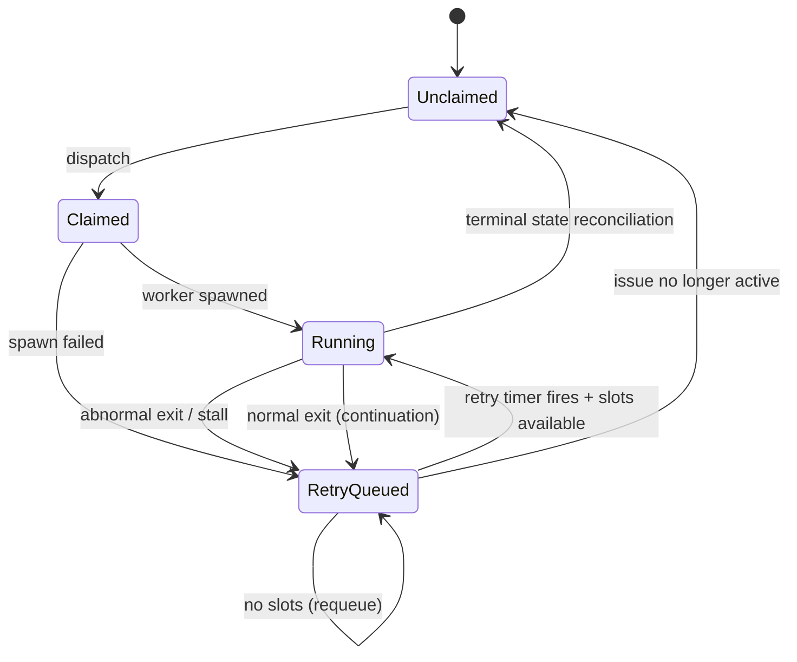
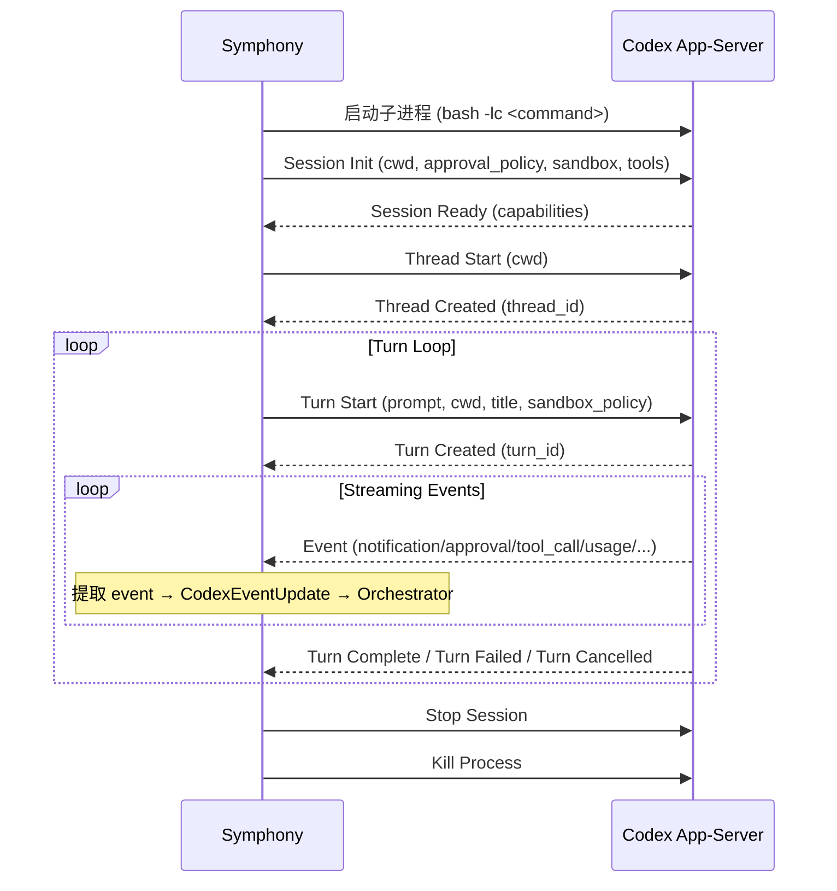

# Symphony Rust 完整重写设计文档

> 本文档是 Symphony 服务 Rust 实现的完整设计蓝图，覆盖 SPEC.md 所有 REQUIRED 行为和 RECOMMENDED 扩展。
> 现有 `docs/platform-adapter-plan.md` 保留为第一阶段 Platform 层设计记录。

---

## 1. 概述与目标

### 1.1 重写动机

现有 `rust-platform-adapter/` 仅覆盖 SPEC 约 20%：
- ✅ `Platform` trait（GitHub/GitLab adapter）
- ✅ 基础 Orchestrator 骨架（spawn worker、简单轮询）
- ✅ Config 加载（WORKFLOW.md front matter 解析）
- ❌ 完整状态机（retry queue、reconciliation、stall detection）
- ❌ Codex app-server 协议客户端
- ❌ Workspace Manager（hooks、safety invariants）
- ❌ Prompt Template Engine（strict Liquid）
- ❌ Token Accounting / Rate Limit 追踪
- ❌ HTTP Server Extension
- ❌ Dynamic Tools（linear_graphql、platform_api）
- ❌ SSH Worker Extension
- ❌ CLI

### 1.2 与 Elixir 参考实现的关系

Elixir 实现是 SPEC 的参考实现（`elixir/`），本 Rust 实现：
- 以 SPEC.md 为唯一权威规范，不逐行翻译 Elixir 代码
- 利用 Rust 类型系统在编译期保证更多不变量
- 使用 tokio 异步运行时替代 OTP/GenServer 模型
- 保留 `Platform` trait 扩展（GitHub/GitLab），这是 Elixir 实现没有的

### 1.3 SPEC 合规目标

| 级别 | 目标 |
|------|------|
| Core Conformance | 100% 覆盖 SPEC Section 17.1–17.7 所有 REQUIRED 行为 |
| Extension Conformance | 实现 HTTP Server Extension + `linear_graphql` tool |
| Real Integration Profile | 提供 Linear 集成烟雾测试框架 |

---

## 2. SPEC 覆盖矩阵

| SPEC Section | 对应 Rust 模块 | 现有状态 | 目标状态 |
|---|---|---|---|
| §5 Workflow Spec | `config::workflow_loader` | ⚠️ 部分 | ✅ 完整 |
| §6 Configuration | `config::service_config` | ⚠️ 部分 | ✅ 完整 |
| §6.2 Dynamic Reload | `config::watcher` | ❌ 缺失 | ✅ 新增 |
| §7 Orchestration SM | `orchestrator` | ⚠️ 骨架 | ✅ 完整状态机 |
| §8 Polling/Scheduling | `orchestrator::scheduler` | ⚠️ 简单轮询 | ✅ 完整 |
| §8.4 Retry/Backoff | `orchestrator::retry` | ❌ 缺失 | ✅ 新增 |
| §8.5 Reconciliation | `orchestrator::reconciler` | ❌ 缺失 | ✅ 新增 |
| §9 Workspace Mgmt | `workspace` | ❌ 缺失 | ✅ 新增 |
| §10 Agent Runner | `agent` | ❌ 缺失 | ✅ 新增 |
| §10 Codex Protocol | `agent::codex_client` | ❌ 缺失 | ✅ 新增 |
| §11 Tracker Client | `tracker::linear` | ❌ 缺失 | ✅ 新增 |
| §11 (GitHub/GitLab) | `platform` | ✅ 已有 | ✅ 保留+增强 |
| §12 Prompt Construction | `prompt` | ❌ 缺失 | ✅ 新增 |
| §13 Logging | `logging` | ❌ 缺失 | ✅ 新增 |
| §13.7 HTTP Server | `server` | ❌ 缺失 | ✅ 新增(Extension) |
| §14 Failure Model | 贯穿各模块 | ❌ 缺失 | ✅ 新增 |
| §16 Ref Algorithms | 贯穿各模块 | ❌ 缺失 | ✅ 新增 |
| Appendix A SSH Worker | `worker::ssh` | ❌ 缺失 | ⚡ OPTIONAL |

---

## 3. 架构总览

### 3.1 组件图



### 3.2 模块依赖关系



### 3.3 数据流

```
WORKFLOW.md ──► Workflow Loader ──► Config Layer ──► Orchestrator
                                                        │
                    ┌───────────────────────────────────┘
                    ▼
              Poll Tick ──► Tracker Client ──► Candidate Issues
                    │
                    ▼
              Dispatch ──► Workspace Manager ──► Agent Runner
                    │                                │
                    │                                ▼
                    │                          Codex Client
                    │                                │
                    ▼                                ▼
              State Update ◄──── Worker Events ◄── Codex Events
                    │
                    ▼
              Retry Queue / Reconciliation / Logging / HTTP API
```

### 3.4 并发模型

- **单一权威**: Orchestrator 通过 `tokio::sync::mpsc` channel 接收所有事件，串行化状态变更
- **Worker 隔离**: 每个 issue 的 Agent Runner 在独立 `tokio::task` 中运行
- **Config 热重载**: `notify` watcher 在独立 task 中监听文件变更，通过 `arc_swap::ArcSwap` 原子替换配置
- **HTTP Server**: `axum` 在独立 task 中运行，通过只读 snapshot 访问 orchestrator 状态

---

## 4. 核心领域模型

### 4.1 Issue

```rust
use chrono::{DateTime, Utc};

/// 阻塞关系引用
#[derive(Debug, Clone, Serialize, Deserialize)]
pub struct BlockerRef {
    pub id: Option<String>,
    pub identifier: Option<String>,
    pub state: Option<String>,
}

/// 标准化 Issue 模型（SPEC §4.1.1）
#[derive(Debug, Clone, Serialize, Deserialize)]
pub struct Issue {
    /// Tracker 内部稳定 ID（Linear UUID / GitHub number as string）
    pub id: String,
    /// 人类可读标识（如 "ABC-123"）
    pub identifier: String,
    pub title: String,
    pub description: Option<String>,
    /// 优先级：数字越小优先级越高，None 排最后
    pub priority: Option<i32>,
    /// 当前 tracker 状态名
    pub state: String,
    pub branch_name: Option<String>,
    pub url: Option<String>,
    /// 标签列表（已 lowercase 标准化）
    pub labels: Vec<String>,
    pub blocked_by: Vec<BlockerRef>,
    pub created_at: Option<DateTime<Utc>>,
    pub updated_at: Option<DateTime<Utc>>,
}
```

### 4.2 WorkflowDefinition

```rust
use serde_yaml::Value as YamlValue;
use std::collections::HashMap;

/// 解析后的 WORKFLOW.md（SPEC §4.1.2）
#[derive(Debug, Clone)]
pub struct WorkflowDefinition {
    /// YAML front matter 根对象
    pub config: HashMap<String, YamlValue>,
    /// Markdown body（trimmed）
    pub prompt_template: String,
}
```

### 4.3 ServiceConfig（Typed View）

```rust
use std::path::PathBuf;
use std::collections::HashMap;

/// 类型化运行时配置（SPEC §4.1.3 + §6.4）
#[derive(Debug, Clone)]
pub struct ServiceConfig {
    // -- tracker --
    pub tracker_kind: TrackerKind,
    pub tracker_endpoint: String,
    pub tracker_api_key: String,
    pub tracker_project_slug: String,
    pub active_states: Vec<String>,
    pub terminal_states: Vec<String>,

    // -- polling --
    pub poll_interval_ms: u64,

    // -- workspace --
    pub workspace_root: PathBuf,

    // -- hooks --
    pub hooks: HooksConfig,

    // -- agent --
    pub max_concurrent_agents: usize,
    pub max_turns: u32,
    pub max_retry_backoff_ms: u64,
    pub max_concurrent_agents_by_state: HashMap<String, usize>,
    /// 需要检查 blocker 的状态列表（默认 ["todo"]）
    pub blocker_check_states: Vec<String>,

    // -- codex --
    pub codex: CodexConfig,

    // -- extensions --
    pub server_port: Option<u16>,
    pub ssh_hosts: Vec<String>,
    pub max_concurrent_agents_per_host: Option<usize>,
}

#[derive(Debug, Clone)]
pub enum TrackerKind {
    Linear,
    GitHub,
    GitLab,
}

#[derive(Debug, Clone)]
pub struct HooksConfig {
    pub after_create: Option<String>,
    pub before_run: Option<String>,
    pub after_run: Option<String>,
    pub before_remove: Option<String>,
    pub timeout_ms: u64,
}

#[derive(Debug, Clone)]
pub struct CodexConfig {
    pub command: String,
    pub approval_policy: Option<String>,
    pub thread_sandbox: Option<String>,
    pub turn_sandbox_policy: Option<String>,
    pub turn_timeout_ms: u64,
    pub read_timeout_ms: u64,
    pub stall_timeout_ms: i64, // <=0 表示禁用 stall detection
}
```

### 4.4 Workspace

```rust
use std::path::PathBuf;

/// 工作区信息（SPEC §4.1.4）
#[derive(Debug, Clone)]
pub struct Workspace {
    pub path: PathBuf,
    pub workspace_key: String,
    pub created_now: bool,
}
```

### 4.5 RunAttempt

```rust
use chrono::{DateTime, Utc};

/// 运行状态枚举（SPEC §7.2）
#[derive(Debug, Clone, PartialEq, Eq)]
pub enum RunStatus {
    PreparingWorkspace,
    BuildingPrompt,
    LaunchingAgentProcess,
    InitializingSession,
    StreamingTurn,
    Finishing,
    Succeeded,
    Failed,
    TimedOut,
    Stalled,
    CanceledByReconciliation,
}

/// 单次执行尝试（SPEC §4.1.5）
#[derive(Debug, Clone)]
pub struct RunAttempt {
    pub issue_id: String,
    pub issue_identifier: String,
    /// None = 首次运行，Some(n) = 第 n 次重试/续跑
    pub attempt: Option<u32>,
    pub workspace_path: PathBuf,
    pub started_at: DateTime<Utc>,
    pub status: RunStatus,
    pub error: Option<String>,
}
```

### 4.6 LiveSession

```rust
use chrono::{DateTime, Utc};

/// Agent 会话元数据（SPEC §4.1.6）
#[derive(Debug, Clone)]
pub struct LiveSession {
    /// "<thread_id>-<turn_id>"
    pub session_id: String,
    pub thread_id: String,
    pub turn_id: String,
    pub codex_app_server_pid: Option<String>,
    pub last_codex_event: Option<String>,
    pub last_codex_timestamp: Option<DateTime<Utc>>,
    /// Monotonic 时间戳，用于 stall detection（避免 NTP 回拨问题）
    pub last_activity_instant: Instant,
    pub last_codex_message: Option<String>,
    pub codex_input_tokens: u64,
    pub codex_output_tokens: u64,
    pub codex_total_tokens: u64,
    pub last_reported_input_tokens: u64,
    pub last_reported_output_tokens: u64,
    pub last_reported_total_tokens: u64,
    pub turn_count: u32,
}
```

### 4.7 RetryEntry

```rust
use tokio::task::JoinHandle;

/// 重试队列条目（SPEC §4.1.7）
#[derive(Debug)]
pub struct RetryEntry {
    pub issue_id: String,
    pub identifier: String,
    /// 1-based 重试次数
    pub attempt: u32,
    /// 重试类型：区分 continuation（正常退出后续跑）和 failure（异常退出重试）
    pub retry_kind: RetryKind,
    /// 到期时间（monotonic ms）
    pub due_at_ms: u64,
    /// tokio timer handle
    pub timer_handle: JoinHandle<()>,
    pub error: Option<String>,
}

#[derive(Debug, Clone, PartialEq, Eq)]
pub enum RetryKind {
    /// 正常退出后的续跑（固定 1s delay）
    Continuation,
    /// 异常退出后的重试（exponential backoff）
    Failure,
}
```

### 4.8 OrchestratorState

```rust
use std::collections::{HashMap, HashSet};

/// Token 累计统计
#[derive(Debug, Clone, Default)]
pub struct CodexTotals {
    pub input_tokens: u64,
    pub output_tokens: u64,
    pub total_tokens: u64,
    /// 累计运行时间（毫秒，使用 monotonic clock）
    pub seconds_running_ms: u64,
}

/// 运行中条目
#[derive(Debug)]
pub struct RunningEntry {
    pub worker_handle: JoinHandle<()>,
    pub cancel_token: CancellationToken,
    pub identifier: String,
    pub issue: Issue,
    pub session: LiveSession,
    pub retry_attempt: Option<u32>,
    pub started_at: Instant,  // 使用 monotonic clock 避免 NTP 回拨问题
    pub started_at_utc: DateTime<Utc>,  // 用于日志和 API 展示
    /// cancel 信号发送时间（用于 hard deadline 强制清理）
    pub cancel_sent_at: Option<Instant>,
}

/// Orchestrator 运行时状态（SPEC §4.1.8）
/// 单一权威，所有状态变更通过 Orchestrator 串行化
#[derive(Debug)]
pub struct OrchestratorState {
    pub poll_interval_ms: u64,
    pub max_concurrent_agents: usize,
    /// issue_id -> RunningEntry
    pub running: HashMap<String, RunningEntry>,
    /// 已声明的 issue IDs（running + retrying）
    pub claimed: HashSet<String>,
    /// issue_id -> RetryEntry
    pub retry_attempts: HashMap<String, RetryEntry>,
    /// 已完成的 issue IDs（带完成时间，用于定期清理）
    pub completed: HashMap<String, Instant>,
    pub codex_totals: CodexTotals,
    pub codex_rate_limits: Option<serde_json::Value>,
    /// 上次防御性配置重读的时间
    pub last_config_check: Instant,
    /// 防御性重读间隔（每 10 个 tick 检查一次文件 hash）
    pub config_check_interval_ticks: u32,
    pub tick_count: u32,
    /// Shutdown 标志：为 true 时所有 dispatch/retry 路径跳过
    pub shutting_down: bool,
}

impl OrchestratorState {
    /// 清理过期的 completed 记录（避免内存泄漏）
    /// 保留最近 1 小时的记录，更早的删除
    pub fn gc_completed(&mut self) {
        let cutoff = Instant::now() - Duration::from_secs(3600);
        self.completed.retain(|_, completed_at| *completed_at > cutoff);
    }
}
```

### 4.9 标识符与标准化规则

```rust
/// Workspace Key 清洗（SPEC §4.2）
/// 将 issue.identifier 中非 [A-Za-z0-9._-] 的字符替换为 '_'
/// 安全保证：结果不能为空、"." 或 ".."（防止路径遍历）
pub fn sanitize_workspace_key(identifier: &str) -> Result<String, WorkspaceError> {
    let sanitized: String = identifier
        .chars()
        .map(|c| {
            if c.is_ascii_alphanumeric() || c == '.' || c == '_' || c == '-' {
                c
            } else {
                '_'
            }
        })
        .collect();

    // 安全检查：禁止空字符串、"."、".." 和纯点号组合
    if sanitized.is_empty()
        || sanitized == "."
        || sanitized == ".."
        || sanitized.chars().all(|c| c == '.')
    {
        return Err(WorkspaceError::UnsafeIdentifier {
            identifier: identifier.to_string(),
        });
    }

    Ok(sanitized)
}

/// Issue 状态标准化比较（SPEC §4.2）
pub fn normalize_state(state: &str) -> String {
    state.to_lowercase()
}

/// Session ID 组合（SPEC §4.2）
pub fn compose_session_id(thread_id: &str, turn_id: &str) -> String {
    format!("{}-{}", thread_id, turn_id)
}
```

---

## 5. 各模块详细设计

### 5.1 WORKFLOW.md Loader

**模块路径**: `src/config/workflow_loader.rs`

**职责**: 读取 WORKFLOW.md 文件，解析 YAML front matter 和 prompt body，返回 `WorkflowDefinition`。

**SPEC 对应**: §5.1–§5.2

#### 公开接口

```rust
use std::path::Path;
use crate::error::SymphonyError;

/// 加载并解析 WORKFLOW.md
pub fn load_workflow(path: &Path) -> Result<WorkflowDefinition, SymphonyError> { ... }

/// 仅解析内容字符串（用于热重载和测试）
pub fn parse_workflow(content: &str) -> Result<WorkflowDefinition, SymphonyError> { ... }
```

#### 解析算法

```text
1. 读取文件内容 → 失败返回 MissingWorkflowFile
2. 如果内容以 "---\n" 开头：
   a. 找到第二个 "---\n" 的位置
   b. 提取中间部分作为 YAML 字符串
   c. serde_yaml::from_str 解析为 HashMap<String, Value>
   d. 如果解析结果不是 Map → 返回 WorkflowFrontMatterNotAMap
   e. 剩余部分 trim 后作为 prompt_template
3. 否则：
   a. config = 空 HashMap
   b. 整个内容 trim 后作为 prompt_template
4. 返回 WorkflowDefinition { config, prompt_template }
```

#### 错误类型

```rust
pub enum WorkflowLoadError {
    MissingWorkflowFile { path: PathBuf },
    WorkflowParseError { source: serde_yaml::Error },
    WorkflowFrontMatterNotAMap,
}
```

#### 设计要点

- 文件路径优先级：CLI 显式指定 > CWD 下的 `WORKFLOW.md`
- 未知 top-level key 静默忽略（前向兼容）
- 空 prompt body 不是错误（运行时 MAY 使用默认 prompt）

---

### 5.2 配置系统（含动态热重载）

**模块路径**: `src/config/service_config.rs`, `src/config/watcher.rs`

**职责**: 将 raw YAML config 解析为类型化 `ServiceConfig`，支持 `$VAR` 解析、默认值填充、验证，以及文件变更热重载。

**SPEC 对应**: §6.1–§6.4

#### 配置解析管线

```rust
impl ServiceConfig {
    /// 从 WorkflowDefinition 构建类型化配置
    pub fn from_workflow(
        workflow: &WorkflowDefinition,
        workflow_dir: &Path,
    ) -> Result<Self, ConfigError> { ... }
}
```

解析步骤（SPEC §6.1）：
1. 从 `workflow.config` 提取各 section（tracker/polling/workspace/hooks/agent/codex）
2. 对缺失的 OPTIONAL 字段填充默认值
3. 对包含 `$VAR_NAME` 的值执行环境变量解析
4. 路径字段执行 `~` 展开 + 相对路径基于 workflow_dir 解析
5. 类型强制转换 + 验证

#### 默认值表

| 字段 | 默认值 |
|------|--------|
| `tracker.endpoint` | `https://api.linear.app/graphql` |
| `tracker.active_states` | `["Todo", "In Progress"]` |
| `tracker.terminal_states` | `["Closed", "Cancelled", "Canceled", "Duplicate", "Done"]` |
| `polling.interval_ms` | `30000` |
| `workspace.root` | `<temp_dir>/symphony_workspaces` |
| `hooks.timeout_ms` | `60000` |
| `agent.max_concurrent_agents` | `10` |
| `agent.max_turns` | `20` |
| `agent.max_retry_backoff_ms` | `300000` |
| `agent.blocker_check_states` | `["todo"]` |
| `codex.command` | `codex app-server` |
| `codex.turn_timeout_ms` | `3600000` |
| `codex.read_timeout_ms` | `5000` |
| `codex.stall_timeout_ms` | `300000` |

#### 环境变量解析

```rust
/// 解析 $VAR_NAME 引用
fn resolve_env_var(value: &str) -> Result<String, ConfigError> {
    if let Some(var_name) = value.strip_prefix('$') {
        match std::env::var(var_name) {
            Ok(v) if !v.is_empty() => Ok(v),
            _ => Err(ConfigError::MissingEnvVar(var_name.to_string())),
        }
    } else {
        Ok(value.to_string())
    }
}
```

#### Dispatch Preflight 验证（SPEC §6.3）

```rust
pub fn validate_for_dispatch(config: &ServiceConfig) -> Result<(), ValidationError> {
    // 1. tracker.kind 存在且支持
    // 2. tracker.api_key 非空（$解析后）
    // 3. tracker.project_slug 非空（Linear 时 REQUIRED）
    // 4. codex.command 非空
}
```

- 启动时验证失败 → 拒绝启动
- 每 tick 验证失败 → 跳过本轮 dispatch，保持 reconciliation

#### 动态热重载（SPEC §6.2）

```rust
use arc_swap::ArcSwap;
use notify::{Watcher, RecursiveMode, Event};
use std::sync::Arc;

/// 全局配置持有者
pub struct ConfigHolder {
    /// 当前生效配置（原子替换）
    current: Arc<ArcSwap<EffectiveConfig>>,
    /// 文件监听器
    _watcher: notify::RecommendedWatcher,
}

/// 生效配置（config + prompt 打包）
pub struct EffectiveConfig {
    pub service: ServiceConfig,
    pub prompt_template: String,
    pub loaded_at: DateTime<Utc>,
}
```

热重载行为：
- `notify` crate 监听 WORKFLOW.md 文件变更事件
- 变更时重新 `load_workflow` → `ServiceConfig::from_workflow`
- 同时重新编译 `PromptEngine` 并通过 `ArcSwap` 原子替换
- 验证通过 → `ArcSwap::store` 原子替换
- 验证失败 → 保留 last known good，emit error log
- **文件删除** → 保留 last known good，emit error log（等同于验证失败）
- 不会 crash 服务（SPEC §6.2 MUST NOT crash）
- Orchestrator 每次 tick 通过 `config_holder.load()` 获取最新配置
- **防御性重读**（SPEC §6.2 SHOULD）：每 10 个 tick 主动读取文件并比较 hash，
  作为 `notify` 丢事件的 fallback（NFS、Docker volume mount 等场景）

**Worker 与热重载的隔离**：
- Worker 在启动时通过 `config.load()` / `prompt_engine.load()` 获取快照
- 运行中的 worker 不受后续热重载影响
- 仅新 dispatch 的 worker 使用新配置和新模板

#### 运行时动态生效的字段

以下字段变更后立即影响后续行为（无需重启）：
- `polling.interval_ms` → 下一次 tick 间隔
- `agent.max_concurrent_agents` → 下一次 dispatch 决策
- `agent.max_retry_backoff_ms` → 下一次 retry 调度
- `agent.max_concurrent_agents_by_state` → 下一次 per-state 检查
- `hooks.*` → 下一次 hook 执行
- `codex.*` → 下一次 agent 启动
- `tracker.active_states` / `terminal_states` → 下一次 reconciliation

---

### 5.3 Issue Tracker Client（Linear + GitHub/GitLab 双轨）

**模块路径**: `src/tracker/mod.rs`, `src/tracker/linear.rs`, `src/platform/`

**职责**: 从 issue tracker 获取候选 issue、刷新状态、获取终态 issue。

**SPEC 对应**: §11

#### Trait 设计（双轨架构）

```rust
/// SPEC 原生 Tracker trait（Linear）
#[async_trait]
pub trait Tracker: Send + Sync {
    /// 获取活跃状态的候选 issue（SPEC §11.1.1）
    async fn fetch_candidate_issues(&self) -> Result<Vec<Issue>, TrackerError>;

    /// 按状态获取 issue（用于启动时终态清理）（SPEC §11.1.2）
    async fn fetch_issues_by_states(&self, states: &[String]) -> Result<Vec<Issue>, TrackerError>;

    /// 按 ID 批量刷新 issue 状态（用于 reconciliation）（SPEC §11.1.3）
    async fn fetch_issue_states_by_ids(&self, ids: &[String]) -> Result<Vec<Issue>, TrackerError>;
}

/// 统一 Issue 来源路由
pub enum IssueSource {
    Linear(Arc<dyn Tracker>),
    Platform(Arc<dyn Platform>),
}
```

#### Linear Adapter 实现

```rust
pub struct LinearClient {
    endpoint: String,
    api_key: String,
    project_slug: String,
    http: reqwest::Client,
    page_size: usize,       // 默认 50
    timeout_ms: u64,        // 默认 30000
}
```

**GraphQL 查询要求**（SPEC §11.2）：
- 候选 issue 查询使用 `project: { slugId: { eq: $projectSlug } }` 过滤
- 状态刷新查询使用 `[ID!]` 类型变量
- 必须分页（`after` cursor），page_size 默认 50
- Auth: `Authorization: <api_key>` header

**标准化规则**（SPEC §11.3）：
- `labels` → lowercase
- `blocked_by` → 从 inverse relations（type = "blocks"）提取
- `priority` → 仅整数，非整数变 None
- `created_at` / `updated_at` → ISO-8601 解析

#### 错误分类

```rust
pub enum TrackerError {
    UnsupportedTrackerKind(String),
    MissingApiKey,
    MissingProjectSlug,
    ApiRequest { source: reqwest::Error },
    ApiStatus { status: u16, body: String },
    GraphqlErrors { errors: Vec<serde_json::Value> },
    UnknownPayload { detail: String },
    MissingEndCursor,
}
```

#### Orchestrator 对 Tracker 错误的处理

| 场景 | 行为 |
|------|------|
| 候选 fetch 失败 | log + 跳过本轮 dispatch |
| 状态刷新失败 | log + 保持 worker 运行 |
| 启动终态清理失败 | log warning + 继续启动 |

#### Platform 适配（GitHub/GitLab）

现有 `Platform` trait 保留，通过 `IssueSource::Platform` 路由。Platform adapter 需要实现等价的三个操作：
- `fetch_candidate_issues` → 基于 label 的状态过滤
- `fetch_issues_by_states` → 按 label 查询终态 issue
- `fetch_issue_states_by_ids` → 按 ID 批量获取当前 label 状态

---

### 5.4 Orchestrator（完整状态机）

**模块路径**: `src/orchestrator/mod.rs`, `src/orchestrator/scheduler.rs`, `src/orchestrator/reconciler.rs`, `src/orchestrator/retry.rs`

**职责**: 拥有 poll tick、管理运行时状态、决定 dispatch/retry/stop/release。

**SPEC 对应**: §7–§8

#### 状态机（SPEC §7.1）



#### 事件驱动架构

```rust
use tokio::sync::mpsc;

/// Orchestrator 接收的事件
pub enum OrchestratorEvent {
    /// 定时 tick 触发
    Tick,
    /// Worker 正常退出
    WorkerExitNormal { issue_id: String },
    /// Worker 异常退出
    WorkerExitAbnormal { issue_id: String, error: String },
    /// Codex 事件更新
    CodexUpdate { issue_id: String, update: CodexEventUpdate },
    /// Retry timer 到期
    RetryFired { issue_id: String },
    /// 配置变更通知
    ConfigReloaded,
    /// 外部触发刷新（HTTP API /refresh）
    ForceRefresh,
    /// 关闭信号
    Shutdown,
}

pub struct Orchestrator {
    state: OrchestratorState,
    config: Arc<ConfigHolder>,
    tracker: IssueSource,
    event_rx: mpsc::Receiver<OrchestratorEvent>,
    event_tx: mpsc::Sender<OrchestratorEvent>,
}
```

#### Poll-and-Dispatch Tick（SPEC §8.1–§8.2）

```text
on_tick():
  0. if state.shutting_down → return  // Shutdown 期间不执行 tick
  1. gc_completed()                  // 清理过期 completed 记录
  2. defensive_config_check()        // 每 N 个 tick 防御性重读 WORKFLOW.md（SPEC §6.2 SHOULD）
  3. reconcile_running_issues():     // §8.5
       let force_killed = reconcile_stalled_runs(state, stall_timeout_ms)
       for entry in force_killed:
         schedule_retry(state, entry.issue_id, entry.identifier,
                        entry.attempt + 1, RetryKind::Failure,
                        compute_retry_delay(entry.attempt + 1, false, config.max_retry_backoff_ms),
                        Some("stall hard deadline exceeded"), event_tx)
       reconcile_tracker_states(state, tracker).await
  4. validate_dispatch_config()      // §6.3
     - 失败 → skip dispatch, 继续
  5. fetch_candidate_issues()
     - 失败 → log, skip dispatch
  6. sort_for_dispatch(issues)       // §8.2 排序
  7. for issue in sorted:
       if no_available_slots() → break
       if should_dispatch(issue) → dispatch_issue(issue, attempt=None)
  8. notify_observers()
  9. schedule_next_tick(poll_interval_ms)
```

**防御性配置重读（SPEC §6.2 SHOULD）**：
```rust
fn defensive_config_check(&mut self) {
    self.tick_count += 1;
    if self.tick_count % self.config_check_interval_ticks != 0 {
        return;
    }
    // 重新读取 WORKFLOW.md 并比较内容 hash
    // 如果 hash 变化但 notify 未触发 → 手动触发重载
    // 这是 notify 丢事件的 fallback（NFS、Docker volume 等场景）
}
```

#### 候选资格检查（SPEC §8.2）

```rust
fn should_dispatch(issue: &Issue, state: &OrchestratorState, config: &ServiceConfig) -> bool {
    // 1. 必须有 id, identifier, title, state
    // 2. state ∈ active_states && state ∉ terminal_states
    // 3. issue.id ∉ running
    // 4. issue.id ∉ claimed
    // 5. 全局并发槽位可用
    // 6. Per-state 槽位可用
    // 7. Blocker 规则（可配置）：
    //    对 blocker_check_states 中的状态，任何 blocker 非终态 → 不调度
    //    默认 blocker_check_states = ["todo"]（SPEC §8.2 原文针对 Todo 状态）
    //    用户可通过配置扩展到其他状态
    if config.blocker_check_states.contains(&normalize_state(&issue.state)) {
        let has_active_blocker = issue.blocked_by.iter().any(|b| {
            b.state.as_ref()
                .map(|s| !config.terminal_states.iter().any(|ts| normalize_state(ts) == normalize_state(s)))
                .unwrap_or(true) // 未知状态视为非终态
        });
        if has_active_blocker { return false; }
    }
    true
}
```

#### 排序规则（SPEC §8.2）

```rust
fn sort_for_dispatch(issues: &mut [Issue]) {
    issues.sort_by(|a, b| {
        // 1. priority 升序（None 排最后）
        let pa = a.priority.unwrap_or(i32::MAX);
        let pb = b.priority.unwrap_or(i32::MAX);
        pa.cmp(&pb)
            // 2. created_at 最早优先
            .then_with(|| a.created_at.cmp(&b.created_at))
            // 3. identifier 字典序
            .then_with(|| a.identifier.cmp(&b.identifier))
    });
}
```

#### 并发控制（SPEC §8.3）

```rust
fn available_global_slots(state: &OrchestratorState) -> usize {
    state.max_concurrent_agents.saturating_sub(state.running.len())
}

fn available_state_slots(
    issue_state: &str,
    state: &OrchestratorState,
    config: &ServiceConfig,
) -> bool {
    let normalized = normalize_state(issue_state);
    if let Some(&limit) = config.max_concurrent_agents_by_state.get(&normalized) {
        let count = state.running.values()
            .filter(|e| normalize_state(&e.issue.state) == normalized)
            .count();
        count < limit
    } else {
        true // 无 per-state 限制
    }
}
```

#### Retry 与 Backoff（SPEC §8.4）

```rust
fn compute_retry_delay(attempt: u32, is_continuation: bool, max_backoff_ms: u64) -> u64 {
    if is_continuation {
        1000 // 正常退出后的续跑 retry：固定 1s
    } else {
        // 失败 retry：10s * 2^(attempt-1)，上限 max_backoff_ms
        let delay = 10_000u64.saturating_mul(2u64.saturating_pow(attempt.saturating_sub(1)));
        delay.min(max_backoff_ms)
    }
}

/// 调度 retry（SPEC §8.4 MUST cancel existing timer for same issue）
fn schedule_retry(
    state: &mut OrchestratorState,
    issue_id: &str,
    identifier: &str,
    attempt: u32,
    retry_kind: RetryKind,
    delay_ms: u64,
    error: Option<String>,
    event_tx: &mpsc::Sender<OrchestratorEvent>,
) {
    // SPEC §8.4: 取消同一 issue 的已有 retry timer
    if let Some(existing) = state.retry_attempts.remove(issue_id) {
        existing.timer_handle.abort();
    }

    let due_at_ms = current_monotonic_ms() + delay_ms;
    let tx = event_tx.clone();
    let id = issue_id.to_string();
    let timer_handle = tokio::spawn(async move {
        tokio::time::sleep(Duration::from_millis(delay_ms)).await;
        let _ = tx.send(OrchestratorEvent::RetryFired { issue_id: id }).await;
    });

    state.retry_attempts.insert(issue_id.to_string(), RetryEntry {
        issue_id: issue_id.to_string(),
        identifier: identifier.to_string(),
        attempt,
        retry_kind,
        due_at_ms,
        timer_handle,
        error,
    });
    // 确保 issue 保持在 claimed 集合中
    state.claimed.insert(issue_id.to_string());
}

/// Release claim：移除 retry entry 并 abort timer（SPEC §8.4）
fn release_claim(state: &mut OrchestratorState, issue_id: &str) {
    if let Some(entry) = state.retry_attempts.remove(issue_id) {
        entry.timer_handle.abort();
    }
    state.claimed.remove(issue_id);
}
```

Retry timer 到期处理（对齐 SPEC §16.6）：
```text
on_retry_fired(issue_id):
  0. if state.shutting_down → 忽略（不 dispatch）
  1. 从 retry_attempts 取出 entry（不存在 → 忽略，可能已被 release）
  2. fetch_candidate_issues()
     - 失败 → schedule_retry(entry.attempt + 1, exponential backoff)
       // SPEC §16.6: fetch 失败重新排队，attempt 递增
  3. 在候选列表中查找 issue_id
     - 未找到 → release_claim（issue 不再活跃）
  4. 找到且 eligible:
     - 有可用槽位 → dispatch(issue, entry.attempt)
     - 无可用槽位 → schedule_retry(entry.attempt + 1, exponential backoff)
       // 遵循 SPEC §16.6: attempt 递增，error="no available orchestrator slots"
  5. 找到但不再 eligible（终态/被阻塞等）→ release_claim
```

**SPEC 偏离说明**：
- `turn_number`/`max_turns`/`is_continuation` 模板变量是本实现的扩展，不属于 SPEC 标准变量集（SPEC §5.4 仅定义 `issue` 和 `attempt`）。用户模板使用这些变量后不可移植到其他 SPEC 实现。
- Continuation retry 的 `attempt=1` 是固定标记而非累计重试次数。HTTP API 中应通过 `retry_kind` 字段区分 continuation 和 failure retry。

#### Reconciliation（SPEC §8.5）

**Part A: Stall Detection（使用 monotonic clock）**
```rust
/// Hard deadline：cancel 后最多等待 30s，超时则 abort task + force kill
const CANCEL_HARD_DEADLINE_MS: u64 = 30_000;

/// Force-kill 后需要 retry 的条目
struct ForceKilledEntry {
    issue_id: String,
    identifier: String,
    attempt: u32,
}

/// 返回需要 retry 调度的 force-killed entries，由调用方负责 schedule_retry
fn reconcile_stalled_runs(
    state: &mut OrchestratorState,
    stall_timeout_ms: i64,
) -> Vec<ForceKilledEntry> {
    if stall_timeout_ms <= 0 { return Vec::new(); } // 禁用

    let mut to_force_kill: Vec<String> = Vec::new();

    for (issue_id, entry) in &mut state.running {
        // 已经发送过 cancel 的 entry：检查 hard deadline
        if let Some(cancel_time) = entry.cancel_sent_at {
            if cancel_time.elapsed().as_millis() as u64 > CANCEL_HARD_DEADLINE_MS {
                // worker 在 cancel 后 30s 仍未退出，标记为需要 force kill
                to_force_kill.push(issue_id.clone());
            }
            // 已 cancel 的 entry 不再重复检测 stall
            continue;
        }

        // 使用 monotonic clock 检测 stall（避免 NTP 回拨问题）
        let elapsed_ms = entry.session.last_activity_instant.elapsed().as_millis() as i64;
        if elapsed_ms > stall_timeout_ms {
            // 首次检测到 stall：发送 cancel 信号并记录时间
            entry.cancel_token.cancel();
            entry.cancel_sent_at = Some(Instant::now());
            tracing::warn!(
                issue_id,
                elapsed_ms,
                "stall detected, cancelling worker"
            );
        }
    }

    // Force kill 超过 hard deadline 的 entry，收集需要 retry 的信息
    let mut needs_retry = Vec::new();
    for issue_id in to_force_kill {
        if let Some(entry) = state.running.remove(&issue_id) {
            entry.worker_handle.abort();
            tracing::error!(
                issue_id = %issue_id,
                "worker exceeded cancel hard deadline, force-killed"
            );
            needs_retry.push(ForceKilledEntry {
                issue_id: issue_id.clone(),
                identifier: entry.identifier.clone(),
                attempt: entry.retry_attempt.unwrap_or(0),
            });
        }
    }
    needs_retry
}
```

**Part B: Tracker State Refresh**
```rust
async fn reconcile_tracker_states(state: &mut OrchestratorState, tracker: &dyn Tracker) {
    let ids: Vec<String> = state.running.keys().cloned().collect();
    if ids.is_empty() { return; }

    match tracker.fetch_issue_states_by_ids(&ids).await {
        Err(_) => { /* log, keep workers running */ }
        Ok(refreshed) => {
            for issue in refreshed {
                if is_terminal(&issue.state) {
                    // terminate + clean workspace
                } else if is_active(&issue.state) {
                    // update in-memory snapshot
                } else {
                    // terminate without cleanup
                }
            }
        }
    }
}
```

#### Worker Exit 处理（SPEC §16.6）

- **正常退出**: `completed.insert(id, Instant::now())` + schedule continuation retry (attempt=1, delay=1s)
- **异常退出**: schedule exponential backoff retry (attempt+1)
- 两者都先 `add_runtime_seconds(entry.started_at)`
- 两者都通过 `release_claim` 的逻辑确保旧 timer 被 abort

---

### 5.5 Workspace Manager

**模块路径**: `src/workspace/mod.rs`

**职责**: 管理 per-issue 工作区的创建、复用、hook 执行、清理，并强制执行安全不变量。

**SPEC 对应**: §9

#### 公开接口

```rust
use std::path::{Path, PathBuf};

pub struct WorkspaceManager {
    root: PathBuf,
    hooks: HooksConfig,
}

impl WorkspaceManager {
    /// 为 issue 创建或复用工作区（SPEC §9.2）
    pub async fn ensure_workspace(&self, identifier: &str) -> Result<Workspace, WorkspaceError> {
        let key = sanitize_workspace_key(identifier)?;
        let path = self.root.join(&key);

        let created_now = if path.is_dir() {
            false
        } else {
            tokio::fs::create_dir_all(&path).await?;
            true
        };

        // 安全检查：目录创建后再验证路径遏制（SPEC §9.5 Invariant 2）
        // 此时 canonicalize 能可靠解析，不会 fallback 到未规范化路径
        self.validate_path_containment(&path)?;

        if created_now {
            if let Some(script) = &self.hooks.after_create {
                self.run_hook("after_create", script, &path).await?;
            }
        }

        Ok(Workspace { path, workspace_key: key, created_now })
    }

    /// 运行 before_run hook（SPEC §9.4）
    pub async fn run_before_run(&self, workspace_path: &Path) -> Result<(), WorkspaceError> { ... }

    /// 运行 after_run hook（失败仅 log）
    pub async fn run_after_run(&self, workspace_path: &Path) { ... }

    /// 清理工作区（SPEC §8.6 + reconciliation）
    pub async fn remove_workspace(&self, identifier: &str) { ... }

    /// 启动时终态工作区清理（SPEC §8.6）
    pub async fn cleanup_terminal_workspaces(&self, identifiers: &[String]) { ... }
}
```

#### Hook 执行合约（SPEC §9.4）

```rust
async fn run_hook(
    &self,
    name: &str,
    script: &str,
    cwd: &Path,
) -> Result<(), WorkspaceError> {
    let timeout = Duration::from_millis(self.hooks.timeout_ms);

    let mut child = tokio::process::Command::new("bash")
        .args(["-lc", script])
        .current_dir(cwd)
        .stdout(Stdio::piped())
        .stderr(Stdio::piped())
        .spawn()?;

    // 预先 take stdout/stderr handle，避免 wait_with_output 消费 child 导致
    // timeout 分支无法访问 child 的所有权问题
    let _stdout = child.stdout.take();
    let _stderr = child.stderr.take();

    tokio::select! {
        result = child.wait() => {
            match result {
                Ok(status) if status.success() => Ok(()),
                Ok(status) => Err(WorkspaceError::HookFailed {
                    hook: name.to_string(),
                    exit_code: status.code(),
                }),
                Err(e) => Err(WorkspaceError::HookIo { source: e }),
            }
        }
        _ = tokio::time::sleep(timeout) => {
            // 超时：使用 child.kill() 发送 SIGKILL（child 未被 move，可直接调用）
            let _ = child.kill().await;
            // wait() 回收僵尸进程
            let _ = child.wait().await;
            Err(WorkspaceError::HookTimeout { hook: name.to_string() })
        }
    }
}
```

#### Hook 失败语义

| Hook | 失败行为 |
|------|----------|
| `after_create` | Fatal → 中止工作区创建 |
| `before_run` | Fatal → 中止当前 attempt |
| `after_run` | Log + 忽略 |
| `before_remove` | Log + 忽略，继续清理 |

#### 安全不变量（SPEC §9.5）

```rust
/// Invariant 2: workspace path 必须在 workspace root 内
/// 注意：必须在目录创建后调用，确保 canonicalize 能解析真实路径
fn validate_path_containment(&self, path: &Path) -> Result<(), WorkspaceError> {
    let canonical_root = self.root.canonicalize()?;
    // 目录必须已存在才能可靠 canonicalize（防止 fallback 到未规范化路径）
    let canonical_path = path.canonicalize().map_err(|_| {
        WorkspaceError::PathOutsideRoot {
            path: path.to_path_buf(),
            root: canonical_root.clone(),
        }
    })?;
    if !canonical_path.starts_with(&canonical_root) {
        return Err(WorkspaceError::PathOutsideRoot {
            path: canonical_path,
            root: canonical_root,
        });
    }
    Ok(())
}

/// Invariant 3: workspace key 只允许 [A-Za-z0-9._-]，且不能为 ".."/"."/"空"
/// （已在 sanitize_workspace_key 中实现，返回 Result）
```

#### 错误类型

```rust
pub enum WorkspaceError {
    UnsafeIdentifier { identifier: String },
    PathOutsideRoot { path: PathBuf, root: PathBuf },
    CreateFailed { source: std::io::Error },
    HookFailed { hook: String, exit_code: Option<i32> },
    HookTimeout { hook: String },
    HookIo { source: std::io::Error },
    RemoveFailed { source: std::io::Error },
}
```

---

### 5.6 Agent Runner + Codex App-Server Client

**模块路径**: `src/agent/mod.rs`, `src/agent/codex_client.rs`, `src/agent/runner.rs`

**职责**: 封装 workspace + prompt + Codex app-server 子进程的完整 worker 生命周期。

**SPEC 对应**: §10

#### Agent Runner 合约（SPEC §10.7）

```rust
pub struct AgentRunner {
    workspace_mgr: Arc<WorkspaceManager>,
    config: Arc<ConfigHolder>,
    prompt_engine: Arc<ArcSwap<PromptEngine>>,
    event_tx: mpsc::Sender<OrchestratorEvent>,
    cancel_token: CancellationToken,
}

impl AgentRunner {
    /// 执行一次完整的 worker attempt（SPEC §16.5）
    pub async fn run_attempt(
        &self,
        issue: Issue,
        attempt: Option<u32>,
        tracker: Arc<dyn Tracker>,
    ) -> Result<(), AgentError> {
        // 0. 启动时快照配置（运行期间不受热重载影响）
        let config_snapshot = self.config.load();
        let prompt_engine = self.prompt_engine.load();

        // 1. 创建/复用 workspace
        let ws = self.workspace_mgr.ensure_workspace(&issue.identifier).await?;

        // 2. before_run hook
        self.workspace_mgr.run_before_run(&ws.path).await?;

        // 3. 启动 Codex session
        let mut client = CodexClient::start(
            &ws.path,
            &config_snapshot.service.codex,
            self.cancel_token.child_token(),
        ).await?;

        // 4. Turn 循环
        let max_turns = config_snapshot.service.max_turns;
        let mut turn_number = 1u32;
        let mut current_issue = issue.clone();

        loop {
            // 检查取消信号
            if self.cancel_token.is_cancelled() {
                client.stop().await;
                self.workspace_mgr.run_after_run(&ws.path).await;
                return Err(AgentError::Cancelled);
            }

            // 构建 prompt（continuation turn 也经过模板引擎）
            let prompt = prompt_engine.render(
                &current_issue, attempt, turn_number, max_turns,
            )?;

            // 执行 turn — 直接传入 Sender，在 async 上下文中 .send().await
            // 避免同步回调 + 异步 channel 的死锁问题
            let result = client.run_turn(
                &prompt,
                &current_issue,
                &self.event_tx,
            ).await;

            if let Err(e) = result {
                client.stop().await;
                self.workspace_mgr.run_after_run(&ws.path).await;
                return Err(e.into());
            }

            // 5. Turn 后刷新 issue 状态（SPEC §16.5 REQUIRED）
            match tracker.fetch_issue_states_by_ids(&[current_issue.id.clone()]).await {
                Err(e) => {
                    client.stop().await;
                    self.workspace_mgr.run_after_run(&ws.path).await;
                    return Err(AgentError::IssueStateRefreshFailed { source: e });
                }
                Ok(refreshed) => {
                    if let Some(updated) = refreshed.into_iter().next() {
                        if is_terminal(&updated.state) || !is_active(&updated.state) {
                            // Issue 不再活跃，正常退出
                            client.stop().await;
                            self.workspace_mgr.run_after_run(&ws.path).await;
                            return Ok(());
                        }
                        current_issue = updated;
                    }
                }
            }

            if turn_number >= max_turns { break; }
            turn_number += 1;
        }

        // 6. 正常结束
        client.stop().await;
        self.workspace_mgr.run_after_run(&ws.path).await;
        Ok(())
    }
}
```

#### Codex Client（SPEC §10.1–§10.3）

```rust
use tokio::process::{Command, Child};
use tokio::io::{AsyncBufReadExt, AsyncWriteExt, BufReader};
use tokio_util::sync::CancellationToken;

pub struct CodexClient {
    child: Child,
    stdin: tokio::io::BufWriter<tokio::process::ChildStdin>,
    stdout: BufReader<tokio::process::ChildStdout>,
    thread_id: Option<String>,
    turn_id: Option<String>,
    pid: Option<String>,
    cancel_token: CancellationToken,
}

impl CodexClient {
    /// 启动 Codex app-server 子进程（SPEC §10.1）
    pub async fn start(
        workspace_path: &Path,
        codex_config: &CodexConfig,
        cancel_token: CancellationToken,
    ) -> Result<Self, CodexError> {
        // 安全检查：cwd == workspace_path（SPEC §9.5 Invariant 1）
        let child = Command::new("bash")
            .args(["-lc", &codex_config.command])
            .current_dir(workspace_path)
            .stdin(Stdio::piped())
            .stdout(Stdio::piped())
            .stderr(Stdio::piped())
            // 创建新 process group，确保 kill 能传播到孙进程
            .process_group(0)
            .spawn()?;

        let pid = child.id().map(|p| p.to_string());
        // ... 初始化 stdin/stdout BufReader
        Ok(Self { child, stdin, stdout, thread_id: None, turn_id: None, pid, cancel_token })
    }

    /// 执行一个 turn（SPEC §10.3）
    /// 直接接受 mpsc::Sender，在 async 循环中 .send().await
    /// 避免同步回调 + 异步 channel 的死锁问题（blocking_send 在 tokio runtime 中会 panic）
    pub async fn run_turn(
        &mut self,
        prompt: &str,
        issue: &Issue,
        event_tx: &mpsc::Sender<OrchestratorEvent>,
    ) -> Result<TurnResult, CodexError> {
        let issue_id = issue.id.clone();
        // clone cancel_token 避免 select! 中 &mut self 与 &self 的借用冲突
        let cancel = self.cancel_token.clone();
        // 发送 turn start 请求
        // 流式读取 stdout JSON-line 事件，同时 select! cancel_token
        tokio::select! {
            result = self.stream_turn_events(prompt, issue, event_tx, &issue_id) => result,
            _ = cancel.cancelled() => {
                self.kill().await;
                Err(CodexError::TurnCancelled)
            }
        }
    }

    /// 流式处理 turn 事件（内部方法）
    /// 逐行读取 stdout JSON-line，解析事件并通过 .send().await 发送到 Orchestrator
    async fn stream_turn_events(
        &mut self,
        prompt: &str,
        issue: &Issue,
        event_tx: &mpsc::Sender<OrchestratorEvent>,
        issue_id: &str,
    ) -> Result<TurnResult, CodexError> {
        // 发送 turn start 请求到 stdin
        self.send_turn_start(prompt, issue).await?;

        // 逐行读取 stdout，解析 JSON-line 事件
        let mut line_buf = String::new();
        loop {
            line_buf.clear();
            let bytes_read = tokio::time::timeout(
                Duration::from_millis(self.turn_timeout_ms),
                self.stdout.read_line(&mut line_buf),
            ).await
                .map_err(|_| CodexError::TurnTimeout)?
                .map_err(|e| CodexError::ProcessExit { code: None })?;

            if bytes_read == 0 {
                return Err(CodexError::ProcessExit { code: self.child.try_wait().ok().flatten().and_then(|s| s.code()) });
            }

            // 解析 JSON-line 事件
            match serde_json::from_str::<serde_json::Value>(&line_buf) {
                Ok(event) => {
                    let update = extract_codex_event(&event);

                    // 检查是否为 turn 终止事件
                    if let Some(result) = check_turn_terminal(&event) {
                        // 发送最终事件更新
                        let _ = event_tx.send(OrchestratorEvent::CodexUpdate {
                            issue_id: issue_id.to_string(),
                            update,
                        }).await;
                        return result;
                    }

                    // 非终止事件：通过 .send().await 发送（背压安全，不会死锁）
                    if let Err(_) = event_tx.send(OrchestratorEvent::CodexUpdate {
                        issue_id: issue_id.to_string(),
                        update,
                    }).await {
                        // channel closed = orchestrator 已关闭
                        self.kill().await;
                        return Err(CodexError::TurnCancelled);
                    }
                }
                Err(_) => {
                    tracing::debug!(raw = %line_buf.trim(), "malformed JSON-line from codex");
                }
            }
        }
    }

    /// 停止会话（graceful）
    pub async fn stop(&mut self) {
        // 发送 stop 请求（best-effort）
        // 等待子进程退出（短超时）
        let _ = tokio::time::timeout(
            Duration::from_secs(5),
            self.child.wait(),
        ).await;
        // 超时则 kill 整个 process group
        self.kill().await;
    }

    /// 强制终止子进程及其 process group
    async fn kill(&mut self) {
        if let Some(pid) = self.child.id() {
            // kill 整个 process group（负 PID）
            unsafe { libc::kill(-(pid as i32), libc::SIGKILL); }
        }
        self.child.kill().await.ok();
    }
}
```

#### 传输协议

- **帧格式**: JSON-line over stdio（每行一个 JSON 对象）
- **最大行长**: 10 MB（安全缓冲）
- **stderr**: 独立处理，不混入协议流

#### 事件提取与上报

```rust
/// 从 Codex 事件中提取的更新信息
pub struct CodexEventUpdate {
    pub event: String,
    pub timestamp: DateTime<Utc>,
    pub pid: Option<String>,
    pub session_id: Option<String>,
    pub thread_id: Option<String>,
    pub turn_id: Option<String>,
    pub usage: Option<TokenUsage>,
    pub rate_limits: Option<serde_json::Value>,
    pub message: Option<String>,
}

pub struct TokenUsage {
    pub input_tokens: u64,
    pub output_tokens: u64,
    pub total_tokens: u64,
}
```

#### Approval / Tool Call / User Input 策略（SPEC §10.5）

本实现采用 **高信任模式**：
- Command execution approvals → 自动批准
- File change approvals → 自动批准
- User input required → 视为 hard failure，终止 turn
- 不支持的 dynamic tool call → 返回 tool failure response，继续会话

#### 超时与错误映射（SPEC §10.6）

```rust
pub enum CodexError {
    NotFound,                    // codex 命令不存在
    InvalidWorkspaceCwd,         // cwd 验证失败
    ResponseTimeout,             // read_timeout_ms 超时
    TurnTimeout,                 // turn_timeout_ms 超时
    ProcessExit { code: Option<i32> },
    ResponseError { detail: String },
    TurnFailed { reason: String },
    TurnCancelled,
    TurnInputRequired,
    MalformedMessage { raw: String },
}
```

#### Continuation Turn 语义（SPEC §7.1 + §10.2）

- 第一个 turn：发送完整渲染后的 issue prompt
- 后续 continuation turn：发送续跑指导（不重发原始 prompt）
- 同一 worker 内所有 turn 复用同一 `thread_id`
- app-server 子进程在 worker 结束时才停止

---

### 5.7 Prompt Template Engine

**模块路径**: `src/prompt/mod.rs`

**职责**: 使用 strict Liquid 模板引擎渲染 per-issue prompt。

**SPEC 对应**: §5.4, §12

#### 公开接口

```rust
use liquid::Template;
use arc_swap::ArcSwap;
use std::sync::Arc;

pub struct PromptEngine {
    /// 编译后的主模板
    template: Template,
    /// 编译后的 continuation 模板（可选，用户可自定义）
    continuation_template: Option<Template>,
}

impl PromptEngine {
    /// 从模板字符串编译（热重载时重新编译并通过 ArcSwap 原子替换）
    pub fn compile(template_str: &str) -> Result<Self, PromptError> {
        let parser = liquid::ParserBuilder::with_stdlib()
            .build()?;
        let template = parser.parse(template_str)?;
        Ok(Self { template, continuation_template: None })
    }

    /// 从主模板 + continuation 模板编译
    pub fn compile_with_continuation(
        template_str: &str,
        continuation_str: Option<&str>,
    ) -> Result<Self, PromptError> {
        let parser = liquid::ParserBuilder::with_stdlib()
            .build()?;
        let template = parser.parse(template_str)?;
        let continuation_template = continuation_str
            .map(|s| parser.parse(s))
            .transpose()?;
        Ok(Self { template, continuation_template })
    }

    /// 渲染 prompt（SPEC §12.2 + §12.3）
    /// turn_number == 1 使用主模板，> 1 使用 continuation 模板
    /// 两者都经过模板引擎渲染，用户可通过 attempt/turn_number 自定义行为
    pub fn render(
        &self,
        issue: &Issue,
        attempt: Option<u32>,
        turn_number: u32,
        max_turns: u32,
    ) -> Result<String, PromptError> {
        let globals = liquid::object!({
            "issue": issue_to_liquid_object(issue),
            "attempt": attempt,
            "turn_number": turn_number,
            "max_turns": max_turns,
            "is_continuation": turn_number > 1,
        });

        if turn_number > 1 {
            if let Some(ref cont_tmpl) = self.continuation_template {
                return cont_tmpl.render(&globals)
                    .map_err(|e| PromptError::RenderError(e.to_string()));
            }
            // 无自定义 continuation 模板时使用默认
            return Ok(format!(
                "Continue working on issue {}. Turn {}/{}.",
                issue.identifier, turn_number, max_turns
            ));
        }

        self.template.render(&globals)
            .map_err(|e| PromptError::RenderError(e.to_string()))
    }
}

/// 热重载协同说明：
/// - PromptEngine 通过 Arc<ArcSwap<PromptEngine>> 持有
/// - ConfigHolder 在 WORKFLOW.md 变更时重新编译模板并原子替换
/// - Worker 在启动时通过 prompt_engine.load() 获取当前快照
/// - 运行中的 worker 不受后续热重载影响（快照语义）
/// - 仅新 dispatch 的 worker 使用新模板
```

#### Strict Mode 要求（SPEC §5.4）

- 未知变量 → **MUST** 失败渲染（`liquid` crate 默认 strict mode）
- 未知 filter → **MUST** 失败渲染
- 嵌套数组/map（labels, blockers）保留可迭代

#### Issue 到 Liquid Object 转换

```rust
fn issue_to_liquid_object(issue: &Issue) -> liquid::Object {
    // 将所有字段转为 Liquid-compatible 值
    // labels: Vec<String> → Liquid Array
    // blocked_by: Vec<BlockerRef> → Liquid Array of Objects
    // priority: Option<i32> → Liquid Value (number or nil)
    // created_at/updated_at: Option<DateTime> → Liquid string (ISO-8601)
}
```

#### Continuation Prompt 构建（SPEC §12.3）

```rust
/// Continuation prompt 策略：
/// 1. 如果 WORKFLOW.md 定义了 continuation_prompt 模板 → 使用该模板渲染
/// 2. 否则使用默认 continuation 文本
///
/// 两种情况都传入完整变量上下文（issue, attempt, turn_number, max_turns）
/// 用户可以在 continuation 模板中使用  等条件逻辑
/// 提供不同的 continuation 指导（SPEC §12.3 SHOULD）
///
/// WORKFLOW.md 中的配置方式：
/// ```yaml
/// continuation_prompt: |
///   Continue working on {{ issue.identifier }}: {{ issue.title }}.
///   This is turn {{ turn_number }}/{{ max_turns }}.
///   This is retry attempt {{ attempt }}.
/// ```
```

#### Fallback Prompt（SPEC §5.4）

- 如果 `prompt_template` 为空 → 使用默认 `"You are working on an issue from Linear."`
- Workflow 文件读取/解析失败 → 不静默 fallback，视为配置错误

#### 错误类型

```rust
pub enum PromptError {
    CompileError(String),
    RenderError(String),
}
```

---

### 5.8 Token Accounting

**模块路径**: `src/orchestrator/metrics.rs`

**职责**: 追踪 token 使用量、运行时间、rate limit 信息。

**SPEC 对应**: §13.5

#### Token 计数规则（SPEC §13.5）

```rust
impl OrchestratorState {
    /// 处理 Codex 事件中的 token 更新
    pub fn update_token_counts(&mut self, issue_id: &str, usage: &TokenUsage) {
        if let Some(entry) = self.running.get_mut(issue_id) {
            // 使用绝对值（thread totals），计算 delta 避免重复计数
            let delta_input = usage.input_tokens
                .saturating_sub(entry.session.last_reported_input_tokens);
            let delta_output = usage.output_tokens
                .saturating_sub(entry.session.last_reported_output_tokens);
            let delta_total = usage.total_tokens
                .saturating_sub(entry.session.last_reported_total_tokens);

            // 安全检查：如果绝对值回退（Codex bug 或 session 重置），记录 warning
            // 任一维度回退时跳过整次更新，避免破坏 total >= input + output 不变量
            if usage.input_tokens < entry.session.last_reported_input_tokens
                || usage.output_tokens < entry.session.last_reported_output_tokens
                || usage.total_tokens < entry.session.last_reported_total_tokens
            {
                tracing::warn!(
                    issue_id,
                    old_input = entry.session.last_reported_input_tokens,
                    new_input = usage.input_tokens,
                    "token absolute value regressed, skipping update and resetting baseline"
                );
                // 重置 baseline 到当前值，从新基线开始累计
                entry.session.last_reported_input_tokens = usage.input_tokens;
                entry.session.last_reported_output_tokens = usage.output_tokens;
                entry.session.last_reported_total_tokens = usage.total_tokens;
                return;
            }

            // 更新 session 级别
            entry.session.codex_input_tokens += delta_input;
            entry.session.codex_output_tokens += delta_output;
            entry.session.codex_total_tokens += delta_total;

            // 更新 last reported
            entry.session.last_reported_input_tokens = usage.input_tokens;
            entry.session.last_reported_output_tokens = usage.output_tokens;
            entry.session.last_reported_total_tokens = usage.total_tokens;

            // 累加全局 totals
            self.codex_totals.input_tokens += delta_input;
            self.codex_totals.output_tokens += delta_output;
            self.codex_totals.total_tokens += delta_total;
        }
    }

    /// Worker 结束时累加运行时间（使用 monotonic clock 避免 NTP 回拨）
    pub fn add_runtime_seconds(&mut self, started_at: Instant) {
        let elapsed = started_at.elapsed();
        self.codex_totals.seconds_running_ms += elapsed.as_millis() as u64;
    }
}
```

#### Token 来源优先级

1. 优先使用 `thread/tokenUsage/updated` 事件中的绝对值
2. 优先使用 `total_token_usage` wrapper 中的绝对值
3. 忽略 `last_token_usage` 等 delta 风格的 payload
4. 从常见字段名（`input_tokens`, `output_tokens`, `total_tokens`）宽松提取

#### Rate Limit 追踪

```rust
/// 更新最新 rate limit 快照
pub fn update_rate_limits(&mut self, payload: serde_json::Value) {
    self.codex_rate_limits = Some(payload);
}
```

#### Runtime Snapshot 计算

```rust
/// 生成当前时刻的 snapshot（用于 HTTP API / status surface）
pub fn snapshot_totals(&self) -> CodexTotals {
    let mut totals = self.codex_totals.clone();
    // 加上当前活跃 session 的实时运行时间（monotonic clock）
    for entry in self.running.values() {
        let elapsed_ms = entry.started_at.elapsed().as_millis() as u64;
        totals.seconds_running_ms += elapsed_ms;
    }
    totals
}
```

---

### 5.9 HTTP Server Extension

**模块路径**: `src/server/mod.rs`, `src/server/api.rs`, `src/server/dashboard.rs`

**职责**: 提供 OPTIONAL HTTP 接口用于可观测性和操作控制。

**SPEC 对应**: §13.7

#### 启用条件

- CLI `--port` 参数提供时启动
- `WORKFLOW.md` 中 `server.port` 存在时启动
- CLI `--port` 优先于 `server.port`
- 默认绑定 `127.0.0.1`（loopback）

#### 技术选型

- **框架**: `axum`（轻量、tokio 原生、tower 中间件生态）
- **状态共享**: 通过 `mpsc::Sender<OrchestratorQuery>` 请求-响应模式获取实时状态
  - HTTP handler 发送查询请求到 Orchestrator
  - Orchestrator 在事件循环中处理查询，返回当前时刻的 snapshot
  - 保证数据一致性（snapshot 在 Orchestrator 串行化上下文中生成）
  - 避免陈旧数据问题（每次请求都获取最新状态）

```rust
/// HTTP 查询请求
pub enum OrchestratorQuery {
    GetState { reply: oneshot::Sender<StateResponse> },
    GetIssue { identifier: String, reply: oneshot::Sender<Option<IssueDetailResponse>> },
}

/// HTTP handler 查询 Orchestrator 的辅助函数（带超时保护）
/// 如果 Orchestrator 已退出或繁忙超时，返回 503
async fn query_orchestrator<T>(
    query_tx: &mpsc::Sender<OrchestratorQuery>,
    build_query: impl FnOnce(oneshot::Sender<T>) -> OrchestratorQuery,
) -> Result<T, StatusCode> {
    let (reply_tx, reply_rx) = oneshot::channel();
    query_tx.send(build_query(reply_tx)).await
        .map_err(|_| StatusCode::SERVICE_UNAVAILABLE)?;
    tokio::time::timeout(Duration::from_secs(5), reply_rx)
        .await
        .map_err(|_| StatusCode::SERVICE_UNAVAILABLE)?  // timeout
        .map_err(|_| StatusCode::SERVICE_UNAVAILABLE)   // channel closed
}
```

#### 路由定义

```rust
use axum::{Router, routing::get, routing::post, Json};

pub fn build_router(state: AppState) -> Router {
    Router::new()
        .route("/", get(dashboard_handler))
        .route("/api/v1/state", get(get_state_handler))
        .route("/api/v1/{identifier}", get(get_issue_handler))
        .route("/api/v1/refresh", post(refresh_handler))
        .with_state(state)
}
```

#### GET /api/v1/state（SPEC §13.7.2）

```rust
#[derive(Serialize)]
pub struct StateResponse {
    pub generated_at: String,
    pub counts: Counts,
    pub running: Vec<RunningRow>,
    pub retrying: Vec<RetryRow>,
    pub codex_totals: CodexTotalsJson,
    pub rate_limits: Option<serde_json::Value>,
}

#[derive(Serialize)]
pub struct RunningRow {
    pub issue_id: String,
    pub issue_identifier: String,
    pub state: String,
    pub session_id: String,
    pub turn_count: u32,
    pub last_event: Option<String>,
    pub last_message: Option<String>,
    pub started_at: String,
    pub last_event_at: Option<String>,
    pub tokens: TokensJson,
}

#[derive(Serialize)]
pub struct RetryRow {
    pub issue_id: String,
    pub issue_identifier: String,
    pub attempt: u32,
    pub due_at: String,
    pub error: Option<String>,
}
```

#### GET /api/v1/{identifier}（SPEC §13.7.2）

- 返回 issue 级别的运行时/调试详情
- 未知 issue → `404` + `{"error":{"code":"issue_not_found","message":"..."}}`

#### POST /api/v1/refresh（SPEC §13.7.2）

```rust
use axum::http::StatusCode;

async fn refresh_handler(
    State(state): State<AppState>,
) -> (StatusCode, Json<RefreshResponse>) {
    // 向 Orchestrator 发送 ForceRefresh 事件
    state.event_tx.send(OrchestratorEvent::ForceRefresh).await.ok();
    (StatusCode::ACCEPTED, Json(RefreshResponse {
        queued: true,
        coalesced: false,
        requested_at: Utc::now().to_rfc3339(),
        operations: vec!["poll".into(), "reconcile".into()],
    }))
}
```

#### Dashboard（GET /）

- 服务端渲染 HTML 或返回静态 SPA
- 展示：活跃 session、retry 延迟、token 消耗、运行时间、最近事件、健康指标
- 可选方案：使用 `askama` 模板引擎生成 HTML

#### 错误处理

- 不支持的 HTTP method → `405 Method Not Allowed`
- API 错误 → `{"error":{"code":"...","message":"..."}}`
- Dashboard/API 失败不影响 Orchestrator 正确性

#### 端口变更

- `server.port` 变更不需要热重绑定（restart-required 是合规行为）

---

### 5.10 Structured Logging

**模块路径**: `src/logging/mod.rs`

**职责**: 提供结构化日志输出，包含 issue/session 上下文字段。

**SPEC 对应**: §13.1–§13.2

#### 技术选型

- **框架**: `tracing` + `tracing-subscriber`
- **格式**: JSON structured logs（生产）/ pretty format（开发）
- **Sink**: stderr（默认）+ 可选文件 sink

#### 上下文字段要求（SPEC §13.1）

```rust
use tracing::{info, warn, error, instrument, Span};

/// Issue 相关日志必须包含的字段
fn log_with_issue_context(issue: &Issue) {
    let span = tracing::info_span!(
        "issue",
        issue_id = %issue.id,
        issue_identifier = %issue.identifier,
    );
    // 所有 issue 相关操作在此 span 内执行
}

/// Session 生命周期日志必须包含的字段
fn log_with_session_context(session_id: &str) {
    let span = tracing::info_span!(
        "session",
        session_id = %session_id,
    );
}
```

#### 日志事件示例

```rust
// Dispatch
info!(issue_id, issue_identifier, attempt, "dispatching issue");

// Worker exit
info!(issue_id, issue_identifier, status = "completed", "worker exited normally");
warn!(issue_id, issue_identifier, error, "worker exited abnormally, scheduling retry");

// Reconciliation
info!(issue_id, issue_identifier, new_state, "issue state changed, terminating worker");

// Config reload
info!("workflow config reloaded successfully");
error!(error, "workflow reload failed, keeping last known good config");

// Hook execution
info!(hook = "before_run", workspace = %path.display(), "running hook");
warn!(hook = "after_run", error, "hook failed, ignoring");
```

#### 设计要点

- 使用稳定 `key=value` 格式
- 包含 action outcome（`completed`, `failed`, `retrying`）
- 包含简洁失败原因
- 避免记录大型 raw payload
- 不记录 API token 或 secret 值
- Log sink 失败不 crash orchestrator

---

### 5.11 CLI

**模块路径**: `src/main.rs`, `src/cli.rs`

**职责**: 命令行入口，解析参数，启动服务。

**SPEC 对应**: §17.7

#### 技术选型

- **框架**: `clap` (derive API)

#### 参数定义

```rust
use clap::Parser;

#[derive(Parser, Debug)]
#[command(name = "symphony", about = "Orchestrate coding agents for project work")]
pub struct Cli {
    /// Path to WORKFLOW.md (default: ./WORKFLOW.md)
    #[arg(value_name = "WORKFLOW_PATH")]
    pub workflow_path: Option<PathBuf>,

    /// HTTP server port (overrides server.port in WORKFLOW.md)
    #[arg(long)]
    pub port: Option<u16>,
}
```

#### 行为规范（SPEC §17.7）

| 场景 | 行为 |
|------|------|
| 无参数 | 使用 `./WORKFLOW.md` |
| 提供路径参数 | 使用指定路径 |
| 显式路径不存在 | 报错退出（非零） |
| 默认 `./WORKFLOW.md` 不存在 | 报错退出（非零） |
| 启动验证失败 | 清晰报错 + 非零退出 |
| 正常启动后正常关闭 | 零退出码 |
| 异常退出 | 非零退出码 |

#### 启动流程

```rust
#[tokio::main]
async fn main() -> anyhow::Result<()> {
    let cli = Cli::parse();

    // 1. 确定 workflow 路径
    let workflow_path = cli.workflow_path
        .unwrap_or_else(|| PathBuf::from("./WORKFLOW.md"));

    if !workflow_path.exists() {
        eprintln!("Error: workflow file not found: {}", workflow_path.display());
        std::process::exit(1);
    }

    // 2. 初始化 logging
    init_logging();

    // 3. 加载并验证配置
    let workflow = load_workflow(&workflow_path)?;
    let config = ServiceConfig::from_workflow(&workflow, workflow_path.parent().unwrap())?;
    validate_for_dispatch(&config)?;

    // 4. 启动 config watcher
    let config_holder = ConfigHolder::new(workflow_path.clone(), config, workflow.prompt_template)?;

    // 5. 启动 orchestrator
    let orchestrator = Orchestrator::new(config_holder.clone(), ...);

    // 6. 可选：启动 HTTP server
    let port = cli.port.or(config_holder.load().service.server_port);
    if let Some(p) = port {
        tokio::spawn(start_http_server(p, orchestrator.snapshot_handle()));
    }

    // 7. 运行主循环
    orchestrator.run().await?;

    Ok(())
}
```

#### 信号处理与 Graceful Shutdown

- `SIGINT` / `SIGTERM` → graceful shutdown

**Shutdown 序列（详细步骤）**：

```rust
/// Graceful shutdown 配置
pub struct ShutdownConfig {
    /// 等待活跃 worker 完成的超时（默认 30s）
    pub worker_drain_timeout_ms: u64,
    /// HTTP server drain 超时（默认 5s）
    pub http_drain_timeout_ms: u64,
}

impl Default for ShutdownConfig {
    fn default() -> Self {
        Self {
            worker_drain_timeout_ms: 30_000,
            http_drain_timeout_ms: 5_000,
        }
    }
}

async fn graceful_shutdown(
    state: &mut OrchestratorState,
    workspace_mgr: &WorkspaceManager,
    http_handle: Option<axum::serve::Handle>,
    config: &ShutdownConfig,
) {
    info!("shutdown signal received, beginning graceful shutdown");

    // 1. 设置 shutting_down 标志（所有 dispatch/retry 路径检查此标志）
    //    不直接 clear claimed，避免已入队的 RetryFired 事件触发意外 dispatch
    state.shutting_down = true;

    // 2. 取消所有 retry timer（abort 后不会再发送 RetryFired 事件）
    for (_, entry) in state.retry_attempts.drain() {
        entry.timer_handle.abort();
    }

    // 3. 通知 HTTP server 停止接受新连接并 drain 现有连接
    if let Some(handle) = http_handle {
        handle.graceful_shutdown(Some(
            Duration::from_millis(config.http_drain_timeout_ms)
        ));
    }

    // 4. 向所有活跃 worker 发送取消信号（通过 CancellationToken）
    //    CancellationToken 会传播到 CodexClient，触发 process group kill
    for (_, entry) in &mut state.running {
        entry.cancel_token.cancel();
        entry.cancel_sent_at = Some(Instant::now());
    }

    // 5. 等待 worker 退出（带超时）
    let drain_deadline = tokio::time::sleep(
        Duration::from_millis(config.worker_drain_timeout_ms)
    );
    tokio::pin!(drain_deadline);

    loop {
        if state.running.is_empty() {
            info!("all workers exited gracefully");
            break;
        }
        tokio::select! {
            _ = &mut drain_deadline => {
                warn!(
                    remaining = state.running.len(),
                    "drain timeout reached, force-killing remaining workers"
                );
                // 6. 超时后 force-kill：cancel token 已发送，
                //    此处 abort JoinHandle 确保 tokio task 被回收
                for (_, entry) in state.running.drain() {
                    // cancel_token 已在步骤 4 cancel，CodexClient 应已 kill process group
                    entry.worker_handle.abort();
                }
                break;
            }
            event = wait_for_worker_exit(&mut state.running) => {
                // 处理 worker 退出事件，从 running 中移除
                handle_worker_exit(state, event, workspace_mgr).await;
            }
        }
    }

    // 7. 清理 claimed 集合（此时所有 worker 和 retry 都已终止）
    state.claimed.clear();

    info!("graceful shutdown complete");
}
```

**Shutdown 保证**：
- 正常退出的 worker 会运行 `after_run` hook
- 被 force-kill 的 worker 不运行 `after_run`（避免 hook 挂起阻塞关闭）
- `shutting_down` 标志阻止所有新 dispatch 和 retry fire
- Retry timer 全部 abort，不会在 shutdown 期间发送新事件
- `claimed.clear()` 在所有 worker 终止后才执行（避免竞态）
- CancellationToken 传播到 CodexClient，触发 process group kill
- HTTP server 完成正在处理的请求后关闭（OrchestratorQuery 有 5s 超时保护）
- 退出码：graceful shutdown 成功 → 0；超时 force-kill → 0（仍视为正常关闭）

---

### 5.12 SSH Worker Extension (OPTIONAL)

**模块路径**: `src/worker/ssh.rs`

**职责**: 在远程主机上通过 SSH 执行 worker run。

**SPEC 对应**: Appendix A

**优先级**: OPTIONAL（Phase 3+）

#### 配置

```yaml
# WORKFLOW.md front matter
worker:
  ssh_hosts:
    - user@host1.example.com
    - user@host2.example.com
  max_concurrent_agents_per_host: 3
```

#### 执行模型

- Orchestrator 仍是单一权威（polling、claims、retries、reconciliation 不变）
- Worker run 通过 SSH stdio 启动 Codex app-server（而非本地子进程）
- `workspace.root` 在远程主机上解释
- 同一 worker 内的 continuation turn 保持在同一主机

#### 调度策略

```rust
pub struct SshScheduler {
    hosts: Vec<SshHost>,
    /// host -> 当前运行数
    host_load: HashMap<String, usize>,
    max_per_host: usize,
}

impl SshScheduler {
    /// 选择可用主机
    pub fn select_host(&self, issue_id: &str) -> Option<&SshHost> {
        // 优先选择之前使用过的主机（retry 时）
        // 否则选择负载最低的主机
        // 所有主机满载 → 返回 None（等待而非 fallback）
    }
}
```

#### 关键考虑

| 问题 | 处理方式 |
|------|----------|
| 远程环境漂移 | 文档化前置要求（shell、codex、auth） |
| Workspace 本地性 | 切换主机 = 冷启动新 attempt |
| 路径安全 | 远程路径同样执行 containment 检查 |
| 主机连接失败 | 区分连接失败 vs agent 失败，不重复执行 |
| 主机健康 | 死主机减少可用容量，不触发 fallback |
| 清理 | 确保在正确主机上执行 workspace cleanup |

---

### 5.13 Dynamic Tools (linear_graphql, platform_api)

**模块路径**: `src/tools/mod.rs`, `src/tools/linear_graphql.rs`, `src/tools/platform_api.rs`

**职责**: 为 Codex session 提供客户端工具扩展。

**SPEC 对应**: §10.5 (linear_graphql extension)

#### Tool 注册架构

```rust
/// 工具规格（在 session startup 时广播给 app-server）
#[derive(Debug, Clone, Serialize)]
pub struct ToolSpec {
    pub name: String,
    pub description: String,
    pub parameters: serde_json::Value, // JSON Schema
}

/// 工具执行 trait
#[async_trait]
pub trait DynamicTool: Send + Sync {
    fn spec(&self) -> ToolSpec;
    async fn execute(&self, input: serde_json::Value) -> ToolResult;
}

pub struct ToolResult {
    pub success: bool,
    pub output: serde_json::Value,
}

/// 工具注册表
pub struct ToolRegistry {
    tools: HashMap<String, Arc<dyn DynamicTool>>,
}

impl ToolRegistry {
    pub fn specs(&self) -> Vec<ToolSpec> { ... }
    pub async fn handle_call(&self, name: &str, input: serde_json::Value) -> ToolResult {
        match self.tools.get(name) {
            Some(tool) => tool.execute(input).await,
            None => ToolResult {
                success: false,
                output: json!({"error": format!("unsupported tool: {}", name)}),
            },
        }
    }
}
```

#### linear_graphql Tool（SPEC §10.5）

```rust
pub struct LinearGraphqlTool {
    endpoint: String,
    api_key: String,
    http: reqwest::Client,
}

impl DynamicTool for LinearGraphqlTool {
    fn spec(&self) -> ToolSpec {
        ToolSpec {
            name: "linear_graphql".into(),
            description: "Execute a GraphQL query/mutation against Linear".into(),
            parameters: json!({
                "type": "object",
                "properties": {
                    "query": { "type": "string", "description": "GraphQL query or mutation" },
                    "variables": { "type": "object", "description": "Optional variables" }
                },
                "required": ["query"]
            }),
        }
    }

    async fn execute(&self, input: serde_json::Value) -> ToolResult {
        // 1. 验证 input.query 非空
        // 2. 验证 query 只包含一个 operation
        // 3. 使用配置的 endpoint + api_key 执行 GraphQL
        // 4. 成功且无 errors → success=true
        // 5. 有 GraphQL errors → success=false，保留 response body
        // 6. 传输失败/auth 缺失 → success=false + error payload
    }
}
```

**可用条件**: `tracker.kind == "linear"` 且 Linear auth 有效

#### platform_api Tool（现有扩展）

```rust
pub struct PlatformApiTool {
    platform: Arc<dyn Platform>,
}

impl DynamicTool for PlatformApiTool {
    fn spec(&self) -> ToolSpec {
        ToolSpec {
            name: "platform_api".into(),
            description: "Execute platform operations (GitHub/GitLab)".into(),
            parameters: json!({ /* ... */ }),
        }
    }

    async fn execute(&self, input: serde_json::Value) -> ToolResult {
        // 路由到 Platform trait 的各种操作
        // set_workflow_state, create_comment, add_labels, etc.
    }
}
```

#### 不支持的 Tool Call 处理

- Agent 请求未注册的 tool → 返回 `success=false` + error message
- 不阻塞 session，继续执行

---

## 6. Codex App-Server 协议详解

**SPEC 对应**: §10.1–§10.6

### 6.1 传输层

- **协议**: JSON-line over stdio（stdin/stdout）
- **帧格式**: 每行一个完整 JSON 对象，以 `\n` 分隔
- **最大行长**: 10 MB
- **stderr**: 诊断输出，独立于协议流

### 6.2 会话生命周期



### 6.3 关键请求/响应

#### Session Init
```json
{
  "method": "session/start",
  "params": {
    "cwd": "/path/to/workspace",
    "approval_policy": "auto-edit",
    "sandbox": "none",
    "tools": [{"name": "linear_graphql", ...}]
  }
}
```

#### Thread Start
```json
{
  "method": "thread/start",
  "params": {
    "cwd": "/path/to/workspace"
  }
}
```

#### Turn Start
```json
{
  "method": "turn/start",
  "params": {
    "thread_id": "...",
    "prompt": "rendered issue prompt...",
    "cwd": "/path/to/workspace",
    "title": "ABC-123: Fix login bug",
    "sandbox_policy": "none"
  }
}
```

### 6.4 事件流处理

从 stdout 逐行读取 JSON，根据 `type` / `method` 字段分类：

| 事件类型 | 处理 |
|----------|------|
| `session_started` | 记录 session info |
| `turn_completed` | 标记 turn 成功 |
| `turn_failed` | 标记 turn 失败 |
| `turn_cancelled` | 标记 turn 取消 |
| `turn_input_required` | 按策略处理（高信任模式 = fail） |
| `approval_request` | 自动批准 |
| `tool_call` | 路由到 ToolRegistry |
| `notification` | 提取 message 用于 status |
| `token_usage` | 提取 usage 更新计数 |
| `rate_limit` | 更新 rate_limits snapshot |
| 其他/malformed | 记录为 `other_message` / `malformed` |

### 6.5 超时机制

| 超时 | 配置 | 默认 | 触发行为 |
|------|------|------|----------|
| Read timeout | `codex.read_timeout_ms` | 5000ms | 启动/同步请求超时 → ResponseTimeout |
| Turn timeout | `codex.turn_timeout_ms` | 3600000ms | 单 turn 总时长 → TurnTimeout |
| Stall timeout | `codex.stall_timeout_ms` | 300000ms | 无事件活动 → Orchestrator kill + retry |

---

## 6.5+ 安全与运维安全（SPEC §15 补充）

本实现的安全姿态声明：

### 信任边界

- **高信任模式**：本实现面向受信环境，采用 auto-approve 策略
- Agent 执行的命令和文件变更自动批准
- User-input-required 视为 hard failure（不等待人工输入）

### 文件系统安全（SPEC §15.2）

- ✅ Workspace path 必须在 workspace root 下（Invariant 2，§5.5 已实现）
- ✅ Agent cwd 必须是 per-issue workspace path（Invariant 1，§5.6 已实现）
- ✅ Workspace 目录名使用 sanitized identifier（Invariant 3，§4.9 已实现）
- RECOMMENDED：生产环境使用专用 OS 用户运行、限制 workspace root 权限

### Secret 处理（SPEC §15.3）

- `$VAR` 间接引用：config 中支持 `$VAR_NAME` 引用环境变量
- 验证 secret 存在性时不打印值（仅 log "api_key present" / "api_key missing"）
- 日志中不输出 API token 或 secret 环境变量值
- `tracing` 层面对敏感字段使用 `skip` 或 redact

### Hook 脚本安全（SPEC §15.4）

- Hooks 是来自 WORKFLOW.md 的任意 shell 脚本 → 完全信任的配置
- Hooks 在 workspace 目录内执行
- Hook stdout/stderr 在日志中截断（避免大量输出）
- Hook timeout 是 REQUIRED 的（防止挂起 orchestrator）

### Harness 加固建议（SPEC §15.5）

本实现文档化以下加固选项（部署时按需启用）：
- 收紧 Codex approval/sandbox 设置（而非最大宽松）
- 添加外部隔离层（容器/VM sandbox、网络限制）
- 过滤 eligible issue（按 label/project 限制 dispatch 范围）
- 收窄 `linear_graphql` tool 的 scope（限制可操作的 project）
- 最小化 agent 可用的工具、凭证、文件路径和网络目标

---

## 7. 错误模型与恢复策略

**SPEC 对应**: §14

### 7.1 失败分类与恢复行为

| 失败类别 | 示例 | 恢复行为 |
|----------|------|----------|
| **Workflow/Config** | WORKFLOW.md 缺失、YAML 无效、tracker.kind 不支持 | 阻止新 dispatch，保持服务存活，继续 reconciliation |
| **Workspace** | 目录创建失败、hook 超时、路径越界 | 当前 attempt 失败 → retry with backoff |
| **Agent Session** | 启动握手失败、turn failed/cancelled、turn timeout、子进程退出 | 当前 attempt 失败 → retry with backoff |
| **Tracker** | API 传输错误、非200状态、GraphQL errors | 候选 fetch 失败 → 跳过本轮；状态刷新失败 → 保持 worker |
| **Observability** | Snapshot 超时、dashboard 渲染错误、log sink 失败 | 不 crash orchestrator |

### 7.2 统一错误枚举

```rust
/// 顶层错误类型
#[derive(Debug, thiserror::Error)]
pub enum SymphonyError {
    #[error("workflow: {0}")]
    Workflow(#[from] WorkflowLoadError),

    #[error("config: {0}")]
    Config(#[from] ConfigError),

    #[error("workspace: {0}")]
    Workspace(#[from] WorkspaceError),

    #[error("tracker: {0}")]
    Tracker(#[from] TrackerError),

    #[error("codex: {0}")]
    Codex(#[from] CodexError),

    #[error("prompt: {0}")]
    Prompt(#[from] PromptError),

    #[error("io: {0}")]
    Io(#[from] std::io::Error),
}
```

### 7.3 Retry 决策矩阵

| Worker 退出原因 | Retry 类型 | Delay |
|----------------|-----------|-------|
| 正常退出（turn loop 完成） | Continuation | 1000ms 固定 |
| Workspace 创建失败 | Exponential | 10s × 2^(n-1) |
| before_run hook 失败 | Exponential | 10s × 2^(n-1) |
| Codex 启动失败 | Exponential | 10s × 2^(n-1) |
| Turn failed/cancelled | Exponential | 10s × 2^(n-1) |
| Turn timeout | Exponential | 10s × 2^(n-1) |
| User input required | Exponential | 10s × 2^(n-1) |
| Stall detected | Exponential | 10s × 2^(n-1) |
| Prompt render error | Exponential | 10s × 2^(n-1) |

### 7.4 部分状态恢复（重启后）

- 不恢复 retry timer
- 不恢复 running session
- 恢复方式：启动终态 workspace 清理 → 重新轮询 → 重新 dispatch

---

## 8. 测试策略

**SPEC 对应**: §17

### 8.1 单元测试

| 模块 | 测试重点 |
|------|----------|
| `workflow_loader` | front matter 解析、空文件、非 map YAML、无 front matter |
| `service_config` | 默认值填充、$VAR 解析、路径展开、验证失败 |
| `sanitize_workspace_key` | 特殊字符替换、边界情况 |
| `sort_for_dispatch` | 优先级排序、null priority、时间排序 |
| `compute_retry_delay` | continuation vs exponential、cap 验证 |
| `token_accounting` | delta 计算、绝对值优先、累加正确性 |
| `prompt_engine` | strict mode 验证、issue 变量渲染、unknown var 失败 |

### 8.2 集成测试

| 场景 | 验证点 |
|------|--------|
| Orchestrator dispatch 循环 | 候选过滤 + 并发控制 + 排序 |
| Reconciliation | 终态停止 + 非活跃停止 + 活跃更新 |
| Retry queue | 正常续跑 + 异常 backoff + cap |
| Stall detection | 超时 kill + retry 调度 |
| Config hot reload | 文件变更 → 新配置生效 → 无效配置保留旧值 |
| Workspace hooks | after_create 仅首次 + before_run 失败中止 + after_run 忽略失败 |
| HTTP API | /state 响应结构 + /refresh 触发 + 404 处理 |

### 8.3 Mock 策略

```rust
/// 测试用 Tracker mock
pub struct MockTracker {
    pub candidates: Vec<Issue>,
    pub state_responses: HashMap<String, Issue>,
}

#[async_trait]
impl Tracker for MockTracker { ... }

/// 测试用 Codex mock（模拟 app-server 行为）
pub struct MockCodexProcess {
    pub events: Vec<serde_json::Value>,
    pub turn_result: TurnResult,
}
```

### 8.4 E2E 测试计划

- 使用 `MockTracker` + `MockCodexProcess` 模拟完整流程
- 验证：issue 从 dispatch → workspace 创建 → agent 运行 → 正常退出 → continuation retry → 再次 dispatch
- 验证：issue 状态变为终态 → reconciliation 停止 worker + 清理 workspace

### 8.5 Real Integration Profile（SPEC §17.8）

- 需要 `LINEAR_API_KEY` 环境变量
- 使用隔离的测试 project/issue
- CI 中标记为 `#[ignore]`，通过 `--ignored` 显式运行
- 跳过时报告为 skipped（非 pass）

---

## 9. 实现顺序

### Phase 1: 核心骨架（Week 1-2）

1. **Config 系统重构** — 完整 ServiceConfig + 验证 + $VAR 解析
2. **Workflow Loader** — 完整解析 + 错误类型
3. **Workspace Manager** — 创建/复用 + hooks + safety invariants
4. **Prompt Engine** — liquid 集成 + strict mode

### Phase 2: Orchestrator 完整状态机（Week 3-4）

5. **Orchestrator 重写** — 事件驱动架构 + mpsc channel
6. **Scheduler** — 候选过滤 + 排序 + 并发控制
7. **Reconciler** — stall detection + tracker state refresh
8. **Retry Queue** — exponential backoff + continuation retry

### Phase 3: Agent 执行层（Week 5-6）

9. **Codex Client** — 子进程管理 + JSON-line 协议 + 事件提取
10. **Agent Runner** — 完整 worker attempt 流程 + turn 循环
11. **Token Accounting** — delta 计算 + snapshot

### Phase 4: 集成层（Week 7-8）

12. **Linear Tracker Client** — GraphQL 查询 + 分页 + 标准化
13. **Dynamic Tools** — linear_graphql + platform_api
14. **Config Hot Reload** — notify watcher + ArcSwap

### Phase 5: 可观测性 + CLI（Week 9-10）

15. **Structured Logging** — tracing 集成
16. **HTTP Server** — axum + API endpoints + dashboard
17. **CLI** — clap + 启动流程 + 信号处理

### Phase 6: 扩展 + 加固（Week 11+）

18. **SSH Worker Extension** — 远程执行
19. **E2E 测试** — 完整流程验证
20. **Real Integration Tests** — Linear 烟雾测试

---

## 10. 与现有代码的关系

### 10.1 保留

| 现有模块 | 处理 |
|----------|------|
| `src/platform/mod.rs` (Platform trait) | ✅ 保留，作为 GitHub/GitLab adapter 接口 |
| `src/platform/github.rs` | ✅ 保留 |
| `src/platform/gitlab.rs` | ✅ 保留 |
| `src/platform/memory.rs` | ✅ 保留（测试用） |
| `src/platform/http_client.rs` | ✅ 保留 |
| `src/platform/retry.rs` | ✅ 保留 |
| `src/platform/cooldown_queue.rs` | ✅ 保留 |
| `src/platform/issue.rs` | ⚠️ 重构为统一 Issue 模型 |
| `src/tools/platform_api.rs` | ✅ 保留，迁移到 DynamicTool trait |

### 10.2 重写

| 现有模块 | 原因 |
|----------|------|
| `src/orchestrator/mod.rs` | 当前仅骨架，需要完整状态机 |
| `src/config/` | 需要完整 ServiceConfig + 热重载 |
| `src/main.rs` | 需要 CLI + 完整启动流程 |
| `src/error.rs` | 需要统一错误模型 |

### 10.3 新增

| 新模块 | 说明 |
|--------|------|
| `src/tracker/` | Linear GraphQL client（SPEC §11） |
| `src/workspace/` | Workspace Manager（SPEC §9） |
| `src/agent/` | Agent Runner + Codex Client（SPEC §10） |
| `src/prompt/` | Prompt Template Engine（SPEC §12） |
| `src/server/` | HTTP Server Extension（SPEC §13.7） |
| `src/logging/` | Structured Logging（SPEC §13） |
| `src/worker/ssh.rs` | SSH Worker Extension（Appendix A） |
| `src/cli.rs` | CLI 参数解析 |

---

## 11. 依赖清单

### 11.1 新增 Crate

| Crate | 版本 | 用途 | 选型理由 |
|-------|------|------|----------|
| `tokio` | 1.x | 异步运行时 | 已有，核心依赖 |
| `tokio-util` | 0.7+ | CancellationToken、辅助工具 | kill 传播机制，tokio 官方扩展 |
| `axum` | 0.7+ | HTTP Server | 轻量、tokio 原生、tower 生态 |
| `clap` | 4.x | CLI 参数解析 | Rust 生态标准 |
| `liquid` | 0.26+ | Liquid 模板引擎 | SPEC 要求 Liquid-compatible strict mode |
| `notify` | 6.x | 文件系统监听 | 跨平台、成熟 |
| `arc-swap` | 1.x | 原子配置替换 | 无锁读取，适合热重载 |
| `tracing` | 0.1 | 结构化日志框架 | Rust 生态标准 |
| `tracing-subscriber` | 0.3 | 日志输出层 | JSON/pretty 格式 |
| `reqwest` | 0.12+ | HTTP 客户端 | 已有，用于 Linear API |
| `serde_yaml` | 0.9+ | YAML 解析 | 已有 |
| `serde_json` | 1.x | JSON 处理 | 已有 |
| `serde` | 1.x | 序列化框架 | 已有 |
| `chrono` | 0.4 | 时间处理（UTC 展示） | 已有，仅用于日志/API 时间戳 |
| `thiserror` | 1.x | 错误派生宏 | 简洁错误定义 |
| `anyhow` | 1.x | 应用级错误 | main 函数错误处理 |
| `libc` | 0.2 | Process group kill | 确保 kill 传播到 Codex 孙进程 |
| `askama` | 0.12+ | HTML 模板（可选） | Dashboard 服务端渲染 |

### 11.2 已有 Crate（保留）

| Crate | 用途 |
|-------|------|
| `tokio` | 异步运行时 |
| `reqwest` | HTTP 客户端 |
| `serde` / `serde_json` / `serde_yaml` | 序列化 |
| `async-trait` | 异步 trait |
| `chrono` | 时间 |

### 11.3 开发依赖

| Crate | 用途 |
|-------|------|
| `tokio-test` | 异步测试工具 |
| `mockall` | Mock 生成 |
| `tempfile` | 临时目录（workspace 测试） |
| `wiremock` | HTTP mock（Linear API 测试） |
| `assert_cmd` | CLI 集成测试 |

---

*文档结束。本设计覆盖 SPEC.md 所有 REQUIRED 行为（§17.1–§17.7）和 RECOMMENDED 扩展（HTTP Server + linear_graphql）。实施时以本文档为蓝图，以 SPEC.md 为权威规范。*
